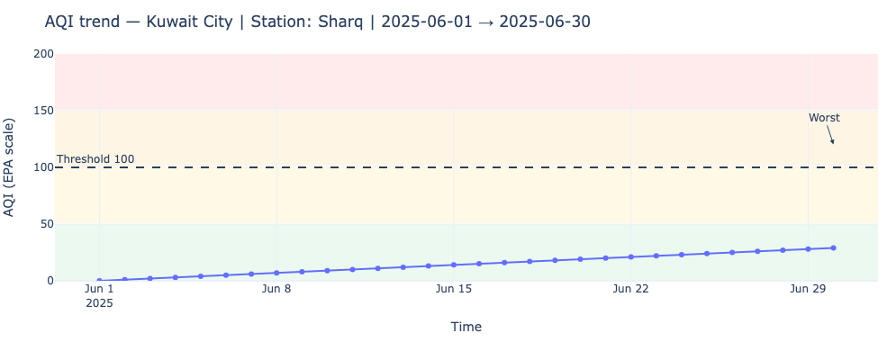
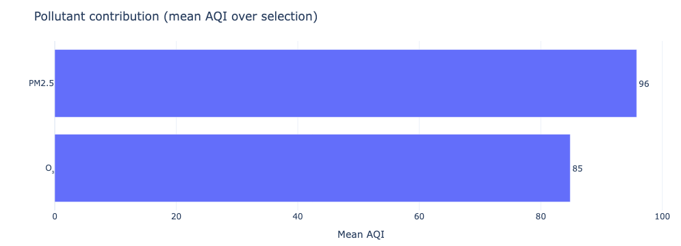

# Abdullah Bohamad - Project 2

#  Air Quality & Health Guidance Dashboard

This project is an **interactive Dash application** that visualizes air quality data and provides **health guidance** based on the Air Quality Index (AQI).

It was built as part of a data visualization course assignment to demonstrate Plotly/Dash interactivity, best practices in communication, and explanatory visualization design.

---

##  Features

- **Interactive controls**:
  - City & station dropdowns  
  - Date range picker  
  - Pollutant selector (PM2.5, O₃)  
  - Aggregation level (hourly, daily, weekly)  
  - AQI threshold slider  

- **Visualizations**:
  1. AQI Trend (line chart) with health bands & threshold line  
  2. Pollutant Contribution (bar chart) showing which pollutant drives AQI  
  3. AQI Category Breakdown (pie chart) showing % of time in EPA risk categories  

- **Dynamic KPIs**:
  - Average AQI  
  - % of periods above threshold  
  - Worst recorded AQI (time & value)  
  - Top pollutant driver  

- **Narrative insights**:
  Auto-generated text summary with health recommendations.

---

## Project Structure

```
├── app.py                  # Main Dash app (localhost)
├── notebook_app.ipynb      # Jupyter notebook version (inline)
├── data/
│   └── processed/
│       └── aq_clean_template.csv   # Input dataset
├── requirements.txt        # Dependencies
├── screenshots/            # App screenshots
└── README.md               # This file
```

---

##  Data

The dataset (`aq_clean_template.csv`) contains hourly air quality measurements (PM2.5 and O₃) for **June 2025** in:

- Barcelona (Eixample, Gracia)  
- Kuwait City (Downtown, Sharq)  
- Málaga (Torremolinos, Fuengirola)  
- Madrid (Chamartin)  

**Columns:**
- `city` — city name  
- `station` — station name  
- `datetime_local` — timestamp (local)  
- `pollutant` — `"pm25"` or `"o3"`  
- `value` — concentration (µg/m³ for PM2.5, ppb for O₃)  

---

##  Installation & Setup

### 1. Clone repo
```bash
git clone (https://github.com/AbdullahBuhamad/COMP_PROJECT2_AIRQUALITY)
cd air-quality-dash
```

### 2. Install dependencies
```bash
pip install -r requirements.txt
```

### 3. Run the app
```bash
python app.py
```
Open browser at **http://127.0.0.1:8053

### 4. You could also run it in Jupyter Notebook
```bash
jupyter notebook
```
Open `notebook_app.ipynb` and run all cells → app runs inline.

---


##  Screenshots

### AQI Trend


### Pollutant Contribution


### AQI Category Breakdown


---

##  Acknowledgements

- Built with [Dash](https://dash.plotly.com/) & [Plotly](https://plotly.com/python/)  
- AQI categories based on U.S. EPA standards  
